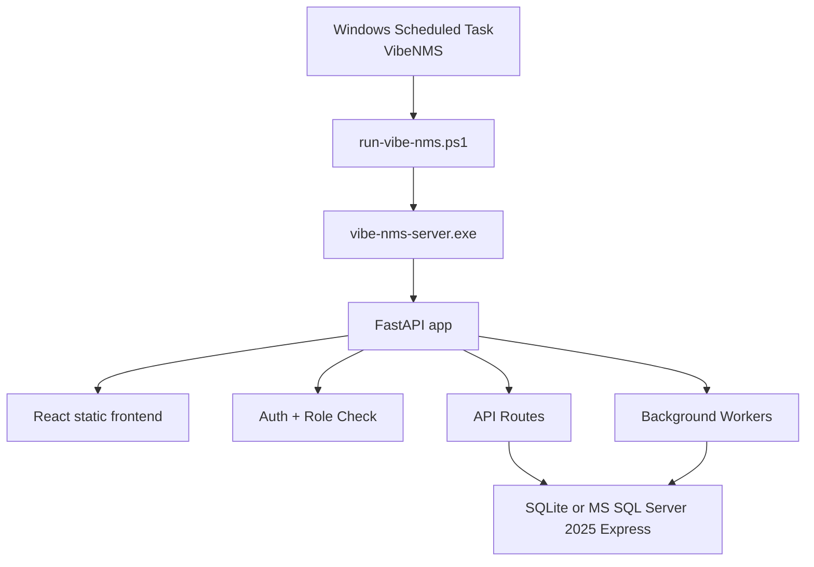
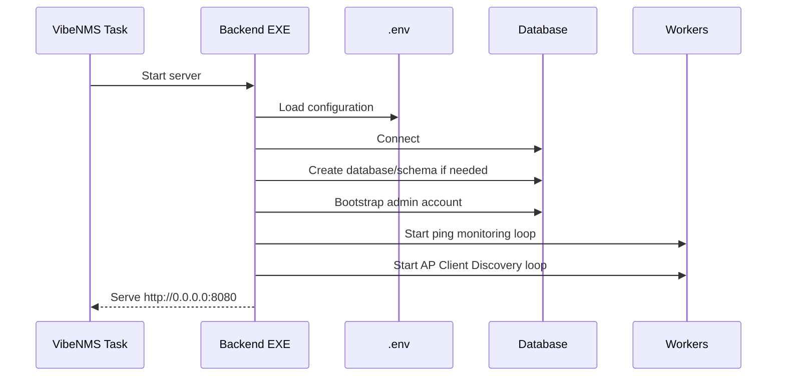

# Backend Workflow

이 문서는 백엔드가 어떻게 켜지고 계속 동작하는지 설명합니다.

## 1. 백엔드 구성



Windows installer로 설치하면 백엔드는 일반 CMD 프로세스가 아니라 `VibeNMS` Scheduled Task로 실행됩니다. 그래서 CMD 창을 닫아도 Task가 살아 있으면 `localhost:8080`이 계속 열려 있을 수 있습니다.

## 2. 시작 순서



## 3. DB 방식

기본 Windows installer는 SQLite를 사용할 수 있습니다.

```text
C:\Program Files\Vibe NMS\data\nms.sqlite
```

회사 운영용으로는 `DB Config`에서 MS SQL Server 2025 Express를 선택할 수 있습니다.

```text
NMS_DATABASE_ENGINE=mssql
NMS_MSSQL_SERVER=localhost\SQLEXPRESS
NMS_MSSQL_PORT=
NMS_MSSQL_DATABASE=vibe_nms
NMS_MSSQL_AUTH=sql
NMS_MSSQL_USERNAME=sa
NMS_MSSQL_PASSWORD=your-password
NMS_MSSQL_DRIVER=ODBC Driver 18 for SQL Server
NMS_MSSQL_ENCRYPT=true
NMS_MSSQL_TRUST_SERVER_CERTIFICATE=true
```

SQL Server 2025 Express에서는 SQL Agent, Enterprise 기능, CLR이 필요 없습니다. 일반 table, index, foreign key, `DATETIME2`, `NVARCHAR(MAX)`, `IDENTITY`를 사용합니다.

## 4. 백엔드가 담당하는 일

백엔드가 직접 수행하는 일:

- 로그인과 ADMIN/USER 권한 확인
- Device Master CRUD
- User Accounts CRUD
- Excel import/export, including Dashboard selected-device XLSX export
- Audit Logs 기록
- Alert 생성, notification list 제공, notification mute
- DB Config 저장과 connection test
- Dashboard 데이터 제공
- Display API 제공
- Ping monitoring worker 실행
- AP Client Discovery worker 실행

브라우저가 직접 수행하지 않는 일:

- 사내망 Ping scan
- AP Controller API token 사용
- SQL credential 저장
- AP Client Discovery

API token과 SQL password는 백엔드 환경변수 또는 `.env`에만 저장되고 frontend에 내려가지 않습니다.

## 5. 주요 Backend Info

앱의 `Backend Info` 화면 또는 ADMIN token으로 아래 API를 호출해 확인합니다.

```text
GET /api/backend/runtime
```

여기서 볼 수 있는 값:

- Backend process
- Port
- Database engine
- SQL Server target
- SQLite path
- Worker status
- Display API path
- DB Config path

## 6. 재시작 방법

DB 설정, `.env`, 포트, collector interval을 바꾼 뒤에는 Task를 재시작합니다.

```powershell
Stop-ScheduledTask -TaskName VibeNMS
Start-ScheduledTask -TaskName VibeNMS
```

완전히 중지하려면:

```powershell
Stop-ScheduledTask -TaskName VibeNMS
```

다시 켜려면:

```powershell
Start-ScheduledTask -TaskName VibeNMS
```

## 7. 시간 기준

UI와 로그 표시는 Mexico/Tijuana 시간 기준입니다.

```text
NMS_TIME_ZONE=America/Tijuana
```

이 기준은 Audit Logs, Monitoring Logs, Alerts, AP Clients, Display Dashboard에 적용됩니다.
## Backend Info Ping Interval

`Backend Info > Background Workers > Ping Interval` exposes ADMIN-only 30, 40, 50, 60, 70, 80, and 90 second options. The selected value is stored in `system_settings.monitoring_interval_seconds`; the ping worker reads that DB setting before waiting for the next loop, so changing it does not require editing `.env`.
