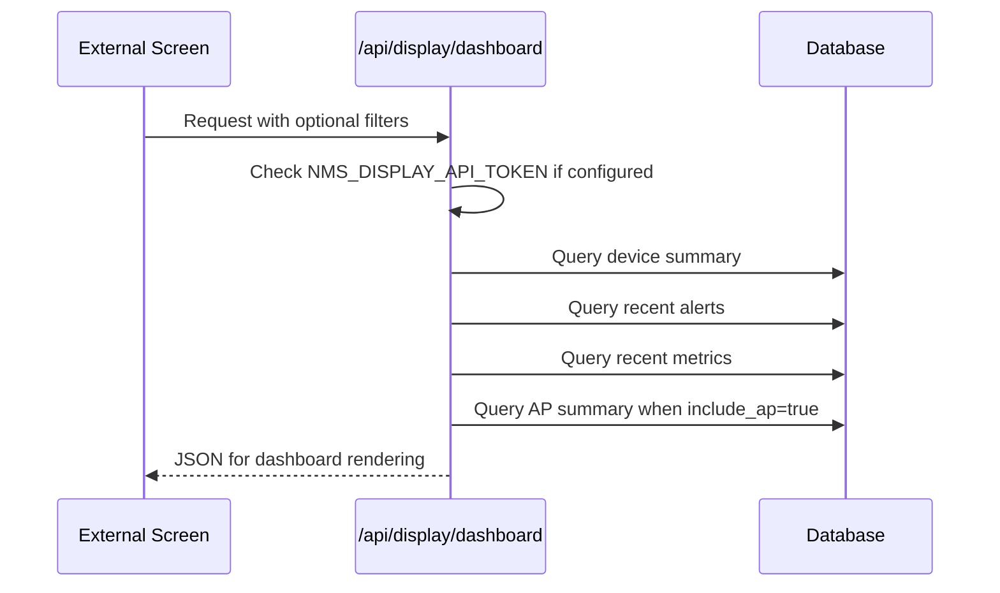

# Dashboard API Workflow

이 문서는 다른 화면, TV, kiosk, 사내 웹페이지에서 Vibe NMS 대시보드 데이터를 가져오는 방법을 설명합니다.

## 1. 목적

관리자 콘솔 전체를 보여주지 않고, 읽기 전용 대시보드만 다른 화면에 띄울 때 사용합니다.

예시:

- 생산 현장 TV 화면
- 사내 포털 embedded dashboard
- NOC kiosk display
- 다른 내부 시스템에서 상태 summary 조회

## 2. Display page

브라우저에서 바로 보는 전체 화면:

```text
http://SERVER_IP:8080/display
```

Plant 필터:

```text
http://SERVER_IP:8080/display?plant=Main%20Plant
```

Plant + Line 필터:

```text
http://SERVER_IP:8080/display?plant=Main%20Plant&line=Assembly%20Line%201
```

## 3. JSON API

GET:

```text
GET /api/display/dashboard
```

GET with filters:

```text
GET /api/display/dashboard?plant=Main%20Plant&line=Assembly%20Line%201&status=OFFLINE
```

POST:

```text
POST /api/display/dashboard
Content-Type: application/json

{
  "plant": "Main Plant",
  "line": "Assembly Line 1",
  "status": "OFFLINE",
  "device_limit": 200,
  "alert_limit": 20,
  "metric_limit": 60,
  "include_ap": true
}
```

## 4. Response 구조

응답에는 대시보드 화면을 만들기 위한 데이터가 들어 있습니다.

```text
generated_at
timezone
filters
summary.status_counts
summary.total_devices
summary.active_alerts
devices
recent_alerts
recent_metrics
by_ap
traffic
```

일반적으로 다른 화면은 아래 값만 써도 충분합니다.

| 필드 | 사용 목적 |
| --- | --- |
| summary.status_counts | ONLINE/WARNING/OFFLINE/CRITICAL 개수 |
| devices | 장치 목록과 상태 |
| recent_alerts | 최근 Alert banner 또는 list |
| recent_metrics | trend chart |
| by_ap | AP별 Client summary |
| traffic | TX/RX current, min, avg, max, trend, top devices |

## 5. 인증 방식

Display API는 읽기 전용입니다. 내부망에서만 열어 두는 경우 token 없이 쓸 수 있습니다.

보안을 걸려면 `.env`에 token을 설정합니다.

```text
NMS_DISPLAY_API_TOKEN=your-readonly-display-token
```

호출 방식 1:

```text
GET /api/display/dashboard?token=your-readonly-display-token
```

호출 방식 2:

```text
X-NMS-Display-Token: your-readonly-display-token
```

Display API token은 ADMIN login token이 아닙니다. 읽기 전용 dashboard 전용 token입니다.

## 6. Dashboard API 흐름



## 7. 간단한 JavaScript 예시

```html
<div id="online"></div>
<div id="offline"></div>

<script>
async function loadDashboard() {
  const response = await fetch("http://SERVER_IP:8080/api/display/dashboard");
  const data = await response.json();
  document.getElementById("online").textContent =
    "ONLINE: " + (data.summary.status_counts.ONLINE || 0);
  document.getElementById("offline").textContent =
    "OFFLINE: " + (data.summary.status_counts.OFFLINE || 0);
}

loadDashboard();
setInterval(loadDashboard, 30000);
</script>
```

사내 포털에서 호출할 때 CORS나 reverse proxy 정책이 있으면 `/api/display/dashboard`를 같은 host 아래로 proxy하는 방식이 가장 단순합니다.

## 8. 주의사항

- Display API는 네트워크를 직접 스캔하지 않습니다.
- API 응답은 DB에 저장된 최신 collector 결과를 보여줍니다.
- 실시간처럼 보이려면 화면에서 30초 정도 간격으로 다시 호출합니다.
- 관리 기능은 포함하지 않습니다.
- 외부 인터넷에 노출하지 말고 사내망 또는 VPN 안에서만 사용합니다.
