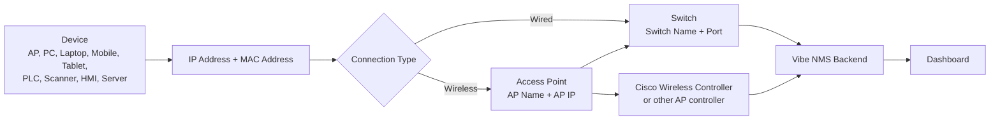

# Device Network Model

이 문서는 `장치 - IP - AP - Switch - Cisco Controller` 관계를 쉽게 설명합니다.

## 1. 한 줄 설명

```text
장치(Device)는 IP/MAC을 가지고 있고, 유선이면 Switch Port에 연결되고, 무선이면 AP에 연결됩니다.
Cisco Controller는 AP와 무선 Client 정보를 알고 있고, Vibe NMS는 이 정보를 백엔드에서 수집해 대시보드에 보여줍니다.
```

## 2. 기본 관계



## 3. 각 정보가 의미하는 것

| 항목 | 의미 | Vibe NMS에서 쓰는 이유 |
| --- | --- | --- |
| Device Name | 사람이 알아보는 장치 이름 | Dashboard, Alert, 검색 |
| IP Address | Ping 모니터링 대상 주소 | Online/Offline 판단 |
| MAC Address | 장치의 네트워크 고유 주소 | AP Client 매칭, 중복 확인 |
| AP Name / AP IP | 무선 장치가 붙어야 하는 AP | wrong AP 감지 |
| Switch Name / Port | 장치 또는 AP가 연결된 유선 포트 | 현장 위치 추적 |
| Cisco Controller | AP와 무선 Client 정보를 제공하는 장비 | AP Client Discovery source |
| Plant Name | 공장 또는 영역 이름 | Dashboard 필터, Plant impact |
| Line Name | 생산 라인 이름 | Dashboard 필터, Line impact |

## 4. 예시

무선 Scanner가 AP에 붙는 경우:

```text
Scanner-01
IP: 105.102.8.127
MAC: AA:BB:CC:11:22:33
Expected AP: AP_LINE1_A
Switch: SW_LINE1 / Gi1/0/12
Cisco Controller: WLC-01
```

Vibe NMS가 보는 방식:

1. Ping worker가 `105.102.8.127`에 Ping을 보냅니다.
2. AP Client Discovery worker가 Cisco Controller에서 AP별 연결 Client를 가져옵니다.
3. Controller가 `AA:BB:CC:11:22:33`이 `AP_LINE1_A`에 연결되어 있다고 알려줍니다.
4. Vibe NMS는 Device Master의 MAC/IP와 비교합니다.
5. 맞는 AP에 있으면 Healthy, 다른 AP에 있으면 Wrong AP Alert를 만듭니다.

## 5. Cisco Controller가 하는 일

Cisco Controller는 보통 다음 정보를 제공합니다.

- 어떤 AP가 controller에 붙어 있는지
- 각 AP에 어떤 무선 Client가 연결되어 있는지
- Client MAC
- Client IP
- SSID
- VLAN
- RSSI
- Last seen

중요한 점:

```text
Cisco Controller는 무선 Client 정보에 강합니다.
일반 유선 장치 전체 목록은 Switch, DHCP, ARP, IPAM 쪽 정보가 더 정확할 수 있습니다.
```

그래서 Vibe NMS는 Device Master를 기준 데이터로 두고, Controller 데이터는 "현재 AP 연결 상태" 확인용으로 사용합니다.

## 6. Device Master 입력 기준

기기마다 필요한 정보가 다르므로 확인된 정보만 넣습니다.

- AP: AP 자체 관리 IP를 `IP Address`에 넣습니다. AP에는 `Connected AP IP`를 따로 넣지 않습니다.
- PC/LAPTOP/MOBILE/TABLET/WORKSTATION: 장치 IP/MAC/Hostname을 넣고, 무선 AP 또는 Switch 위치는 확인된 경우에만 넣습니다.
- PLC/HMI/ROBOT/SCANNER/CAMERA/PRINTER/SENSOR/IOT: 생산 장치의 IP와 MAC을 우선 넣고, AP/Switch 위치는 확인된 경우에만 넣습니다.
- SWITCH/ROUTER/FIREWALL/CONTROLLER/SERVER/NAS/UPS: 인프라 장치 정보만 넣고, 무선 AP Client용 필드는 쓰지 않습니다.

## 7. Alert 예시

Unknown Client:

```text
Controller에는 보이는데 Device Master에 MAC/IP가 없음
```

Wrong AP:

```text
Device Master에는 AP_LINE1_A가 expected AP인데 실제로는 AP_LINE2_B에 연결됨
```

Duplicate IP:

```text
서로 다른 MAC이 같은 IP를 사용함
```

Critical Missing:

```text
중요 장치가 expected AP에 보여야 하는데 현재 Client 목록에서 사라짐
```

AP Client Count Drop:

```text
이전에는 Client 20개였는데 현재 8개만 보임
```
