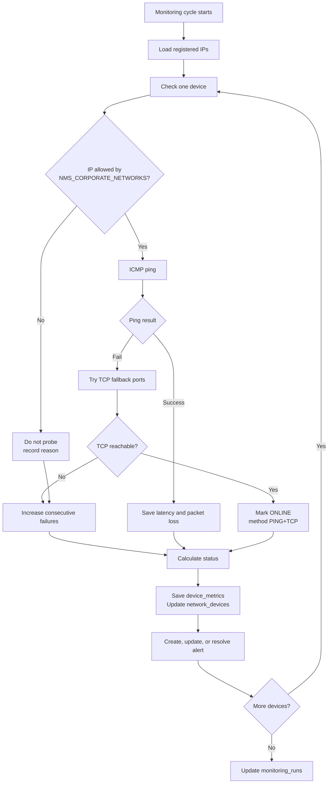
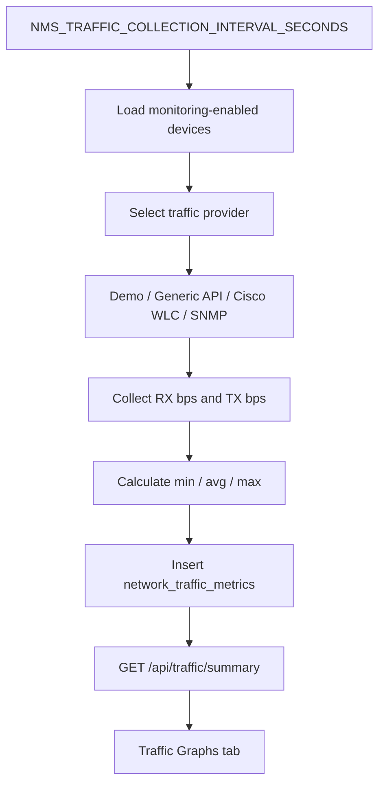

# Monitoring Workflow

이 문서는 등록된 IP를 Vibe NMS가 어떻게 계속 모니터링하는지 설명합니다.

## 1. 기본 원칙

```text
모니터링은 브라우저가 아니라 백엔드 worker가 수행합니다.
서버 PC가 사내망 안에 있어야 실제 장치 IP를 확인할 수 있습니다.
```

현재 ping monitoring worker는 `network_devices`에서 삭제되지 않았고 IP Address가 비어 있지 않은 장치를 읽어 계속 체크합니다.

```sql
SELECT * FROM network_devices
WHERE is_deleted = 0
  AND ip_address IS NOT NULL
  AND ip_address != ''
ORDER BY id
```

## 2. 체크 흐름



## 3. 상태 판정

| 조건 | 상태 |
| --- | --- |
| Ping 성공, latency/loss 정상 | ONLINE |
| Ping 실패 1-2회 | WARNING |
| Ping 실패 3-4회 | OFFLINE |
| Ping 실패 5회 이상이고 criticality가 HIGH/CRITICAL | CRITICAL |
| Packet loss가 warning threshold 이상 | WARNING |
| Latency가 warning threshold 이상 | WARNING |
| HIGH/CRITICAL 장치 latency가 critical threshold 이상 | CRITICAL |
| 최근 상태가 계속 Up/Down 반복 | FLAPPING |

기본 설정:

```text
NMS_COLLECTOR_INTERVAL_SECONDS=30
NMS_COLLECTOR_TIMEOUT_MS=1000
NMS_PING_COUNT=3
NMS_WARNING_LATENCY_MS=150
NMS_CRITICAL_LATENCY_MS=500
NMS_WARNING_PACKET_LOSS_PERCENT=5
```

## 4. ICMP Ping과 TCP fallback

회사 PC는 실제로 온라인이어도 Windows Firewall 또는 endpoint security 때문에 ICMP Ping을 막을 수 있습니다.

그래서 Vibe NMS는 Ping 실패 시 TCP fallback을 시도합니다.

```text
NMS_TCP_FALLBACK_PORTS=445,3389,80,443
```

예를 들어 Ping은 실패했지만 445 또는 3389 포트가 응답하면:

```text
Status: ONLINE
Method: PING+TCP
Reason: ICMP ping did not reply, but TCP port confirmed reachability.
```

이 경우 화면의 `ICMP Loss 100%`는 Ping 기준 loss입니다. 장치가 실제로 사용 불가능하다는 뜻이 아닐 수 있습니다.

## 5. Corporate Network Range

백엔드는 등록 IP가 허용된 사내망 범위 안에 있을 때만 probe합니다.

```text
NMS_CORPORATE_NETWORKS=10.0.0.0/8,172.16.0.0/12,192.168.0.0/16
```

회사에서 `105.102.x.x` 같은 사내 IP를 쓰면 범위를 추가해야 합니다.

```text
NMS_CORPORATE_NETWORKS=10.0.0.0/8,172.16.0.0/12,192.168.0.0/16,105.102.0.0/16
```

변경 후에는 `VibeNMS` Task를 재시작합니다.

```powershell
Stop-ScheduledTask -TaskName VibeNMS
Start-ScheduledTask -TaskName VibeNMS
```

## 6. Alert 생성 방식

Status가 `ONLINE`, `UNKNOWN`, `DISABLED`가 아니면 ACTIVE Alert가 생성되거나 업데이트됩니다.

Alert type 예시:

- PACKET_LOSS
- LATENCY
- WARNING
- OFFLINE
- CRITICAL
- FLAPPING

다시 ONLINE이 되면 기존 ACTIVE 또는 ACKNOWLEDGED Alert는 RESOLVED로 바뀝니다.

## 7. AP Client Discovery는 별도 worker

Ping monitoring과 AP Client Discovery는 서로 다른 worker입니다.

| Worker | 대상 | 목적 |
| --- | --- | --- |
| Ping monitoring worker | 등록된 모든 IP | 장치 reachability 확인 |
| AP Client Discovery worker | Device Type=AP, Monitoring Enabled=ON | AP별 무선 Client 확인 |
| Traffic collection worker | Monitoring Enabled=ON 장치 | TX/RX traffic snapshot 저장 |

AP Client Discovery는 Cisco WLC, Meraki, Aruba, UniFi, SNMP, Generic API, Demo provider 구조를 사용합니다.

## 8. Traffic 수집 방식

Traffic Graphs는 Ping 결과가 아니라 별도 `network_traffic_metrics` 데이터를 사용합니다.



기본값:

```text
NMS_TRAFFIC_COLLECTION_ENABLED=true
NMS_TRAFFIC_COLLECTION_INTERVAL_SECONDS=60
NMS_TRAFFIC_DEFAULT_PROVIDER=demo
NMS_TRAFFIC_GENERIC_API_URL=
NMS_TRAFFIC_GENERIC_API_TOKEN=
```

`demo` provider는 UI 확인용입니다. 실제 traffic은 Cisco Controller, SNMP, 또는 사내 collector API에서 백엔드가 가져와야 합니다.

Traffic Graphs API는 날짜 range와 그래프 단위를 받습니다.

```text
GET /api/traffic/summary?date_from=2026-06-30T08:00&date_to=2026-06-30T17:00&bucket=minute
GET /api/traffic/summary?date_from=2026-06-30T00:00&date_to=2026-06-30T23:59&bucket=hour
```

`date_from`과 `date_to`는 `NMS_TIME_ZONE` 기준으로 해석됩니다. 기본 installer 설정은 `America/Tijuana`입니다.
