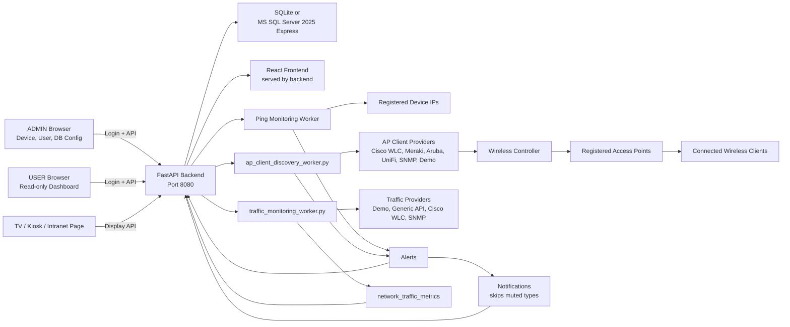
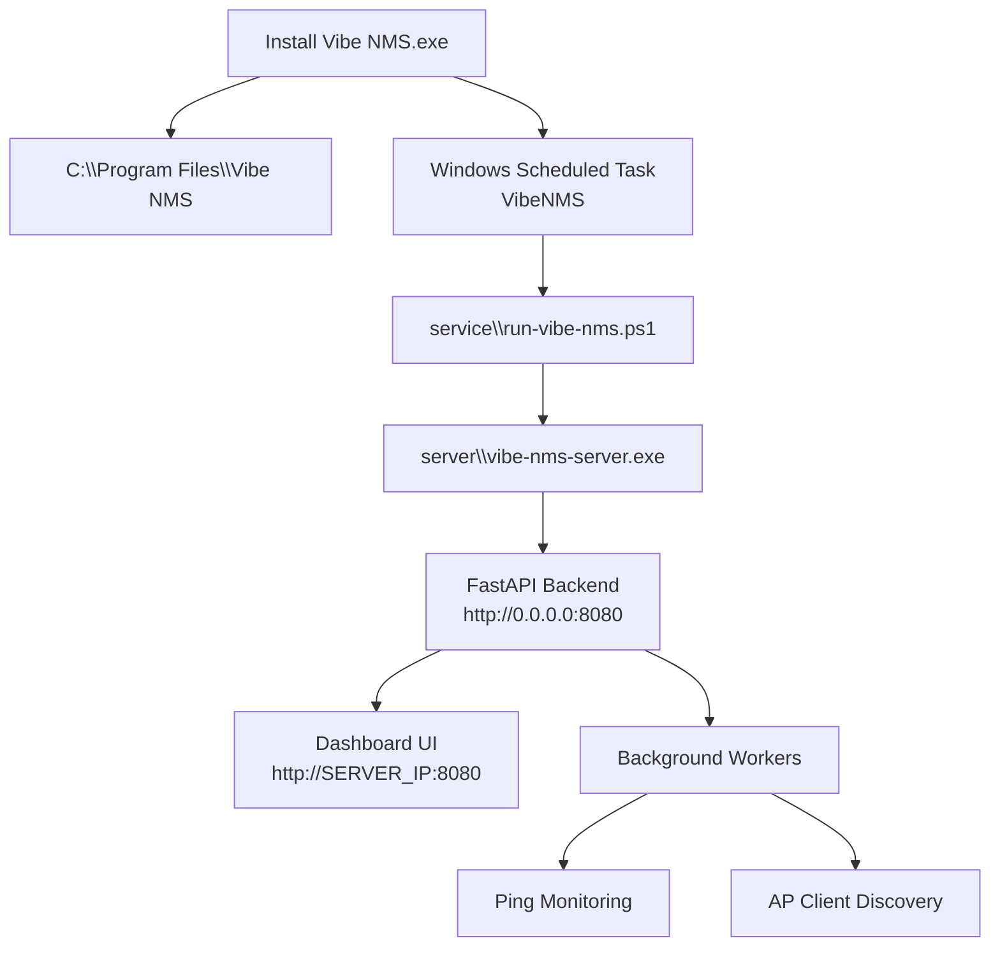
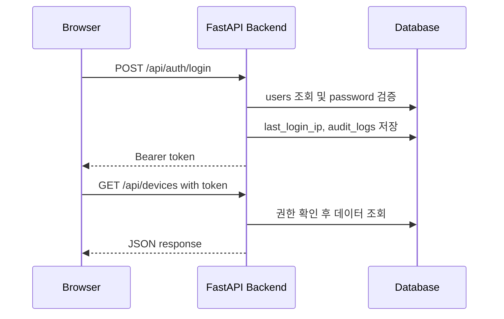
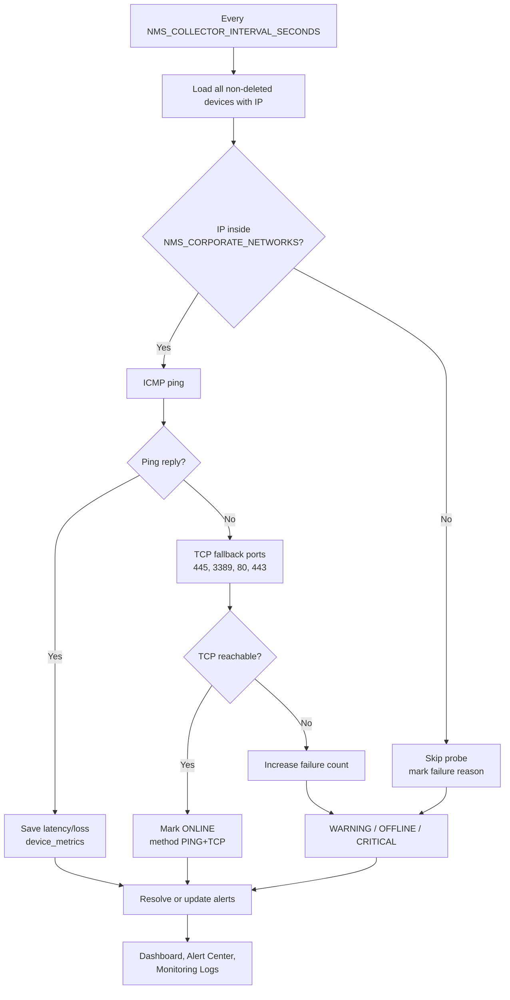
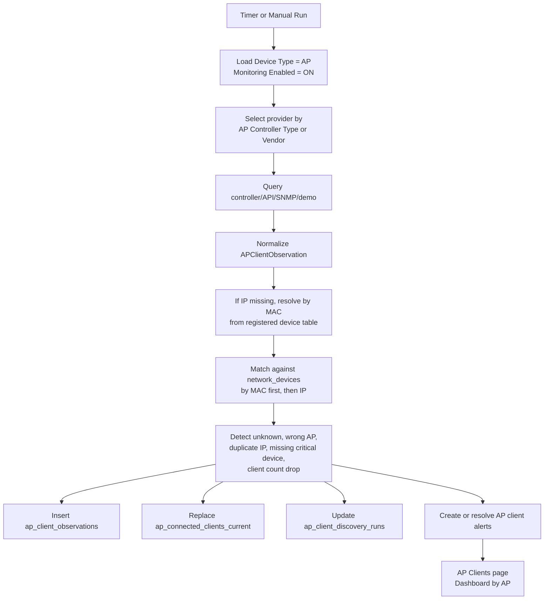
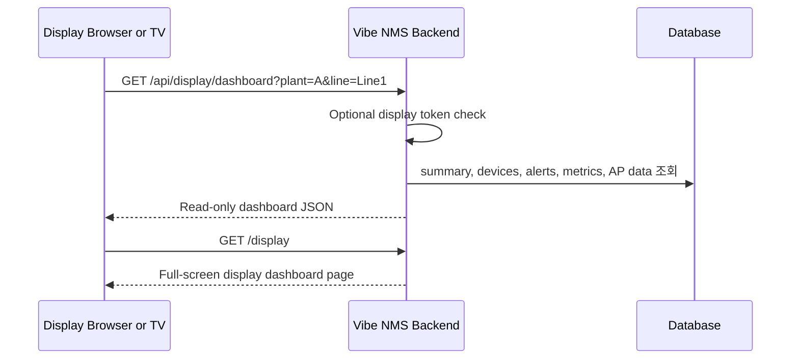
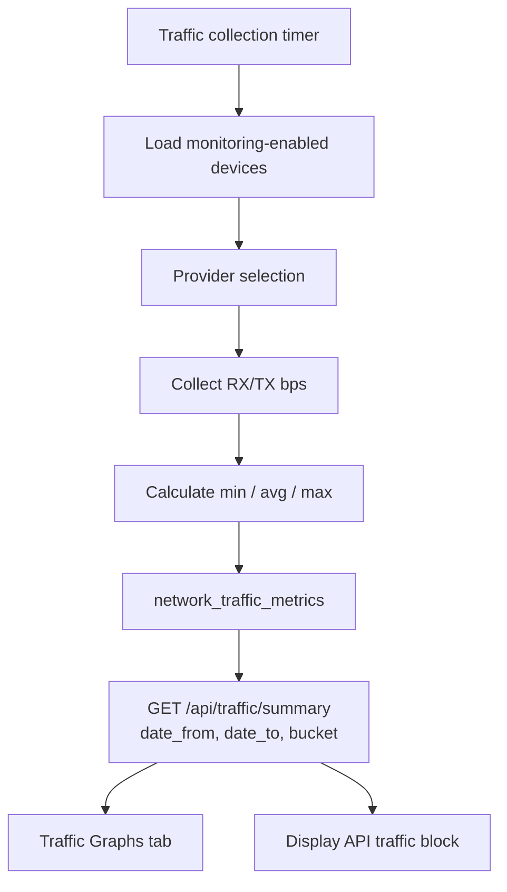

# Workflow Diagrams

이 문서는 Vibe NMS가 어떤 흐름으로 동작하는지 그림으로 설명합니다.

## 1. 전체 시스템 흐름

## 2. Windows 설치 후 실행 흐름

CMD 창을 닫아도 `VibeNMS` Scheduled Task가 살아 있으면 백엔드는 계속 동작합니다.

## 3. 로그인과 일반 API 흐름

## 4. Ping Monitoring 흐름

## 5. AP Client Discovery 흐름

## 6. 외부 Dashboard API 흐름

`/api/display/dashboard`는 읽기 전용입니다. 관리 기능은 일반 로그인 API와 ADMIN 권한이 필요합니다.

## 7. Traffic Graphs 흐름

